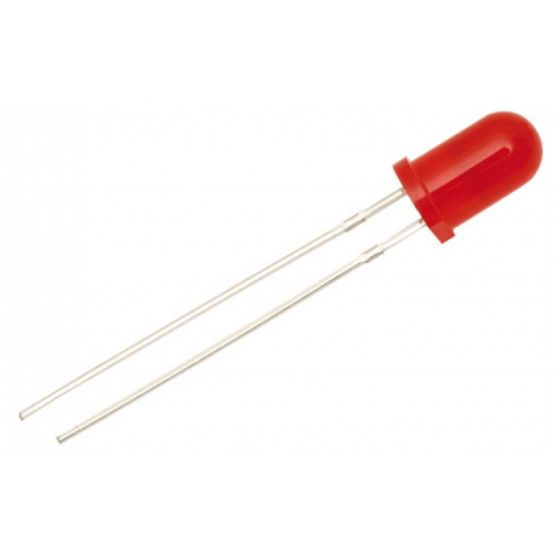

# LED-Pushbutton
# LED
## Sensor LED
### Por: Adrian de Jesus Cuevas Martinez 19211623
------

Un diodo LED es un dispositivo que permite el paso de corriente en un solo sentido y que al ser polarizado
emite un haz de luz. Trabaja como un diodo normal pero al recibir corriente eléctrica emite luz. Los LED
trabajan aproximadamente con corriente de 2V. Para conectarlos a un voltaje distinto, se debe usar una
resistencia.

Su funcionamiento es bastante simple pues se conecta la corriente al semiconductor superior del diodo LED lo cual permitirá el paso de corriente eléctrica y hará que el semiconductor emita luz, algo a tomar en cuenta es que según el material del que esté elaborado el semiconductor los diodos LED proyectarán luces de distintos colores.

Una de sus características más importantes es la gran potencia de iluminación que poseen sin aumentar su temperatura, por ello se puede usar en muchas aplicaciones sin afectar su entorno directo.

La otra característica determinante que poseen los LED es una diferencia fundamental con las luces ahorradoras y es que no poseen elementos tóxicos y alcanzan su máximo rendimiento apenas son encendidos, además son reciclables pues pueden ser reparados y también fácilmente sustituidos cuando se daña uno.

Los Led están formados por el material semiconductor que está envuelto en un plástico translúcido o transparente según los modelos, el electrodo interno de menor tamaño es el ánodo y el de mayor tamaño es el cátodo.

### Principio físico
El fenómeno de emisión de luz está basado en la teoría de banda por la cual una tensión externa aplicada a una unión PN polarizada directamente se excitan los electrones de manera que son capaces de atravesar la banda de energía que separa las dos regiones de esta forma si la energía es suficiente los electrones escapan del material en forma de fotones, por esto mismo cada material semiconductor tiene unas determinadas características y por tanto una longitud de onda de la luz emitida.

|   |   |   |   |   |
|---|---|---|---|---|
|   |   |   |   |   |
|   |   |   |   |   |
|   |   |   |   |   |

