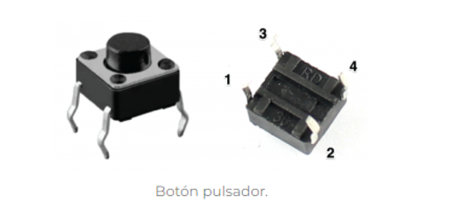

# LED-Pushbutton
### Por: Adrian de Jesus Cuevas Martinez 19211623

------
# LED

Un diodo LED es un dispositivo que permite el paso de corriente en un solo sentido y que al ser polarizado
emite un haz de luz. Trabaja como un diodo normal pero al recibir corriente eléctrica emite luz. Los LED
trabajan aproximadamente con corriente de 2V. Para conectarlos a un voltaje distinto, se debe usar una
resistencia.

Su funcionamiento es bastante simple pues se conecta la corriente al semiconductor superior del diodo LED lo cual permitirá el paso de corriente eléctrica y hará que el semiconductor emita luz, algo a tomar en cuenta es que según el material del que esté elaborado el semiconductor los diodos LED proyectarán luces de distintos colores.

Los Led están formados por el material semiconductor que está envuelto en un plástico translúcido o transparente según los modelos, el electrodo interno de menor tamaño es el ánodo y el de mayor tamaño es el cátodo.

### Principio físico
El fenómeno de emisión de luz está basado en la teoría de banda por la cual una tensión externa aplicada a una unión PN polarizada directamente se excitan los electrones de manera que son capaces de atravesar la banda de energía que separa las dos regiones de esta forma si la energía es suficiente los electrones escapan del material en forma de fotones, por esto mismo cada material semiconductor tiene unas determinadas características y por tanto una longitud de onda de la luz emitida.

|  Material |  Longitud de Onda | Color  |   
|---|---|---|
| GaAs : Zn  | 9000 A  |  Infrarrojo |  
| GaAsP.4  |  6600 A | Rojo  |  
| GaAsP.5  | 6100 A | Ambar  |   
| GaAsP.85 : N  | 5900 A  | Amarillo  |  
| GaP : N  | 5600 A  | Verde  |  

----
# Pushbutton

El pulsador o pushbutton solo se abre o se cierra cuando el usuario lo presiona y lo mantiene presionado, mientras lo mantenemos pulsado el interruptor este permite el  paso de energía, o lo interrumpe al dejar de pulsar, esta compuesto en su mayoría, por 2 terminales o pines, estas terminales pueden estar o no en contacto eléctrico dependiendo de si el botón está siendo presionado o no

Al soltarlo vuelve a su posición inicial.
Para que el pulsador funcione debe tener un resorte o muelle que hace que vuelva a la posición anterior después de presionarlo.

El botón cuenta con cuatro terminales, los pines 1 y 2 están unidos internamente, así como los pines 3 y 4. Cuando pulsamos el botón, se realiza una conexión entre ellos

Los push button pueden clasificarse en:

Normalmente abierto: Sus terminales no están en contacto eléctrico cuando el botón no es presionado y entran en contacto eléctrico cuando el botón es presionado.

Normalmente cerrado: Sus terminales están en contacto eléctrico cuando el botón no es presionado y dejan de tener contacto eléctrico cuando el botón es presionado.

### Características:

Utilizado como switch o interruptor al momento de ser presionado.

Funciona como contacto normalmente abierto (NA).

Infinito número de aplicaciones.

Aguanta hasta 50 A.

Voltaje: 120 VDC/ 220 VAC.

Tamaño muy reducido.

4 pines amigables para usar en el protoboard.

